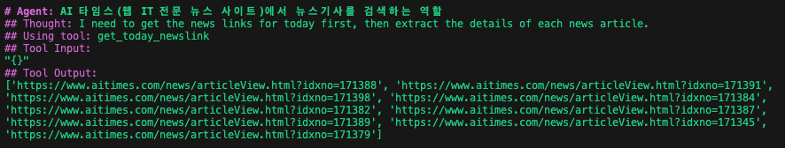
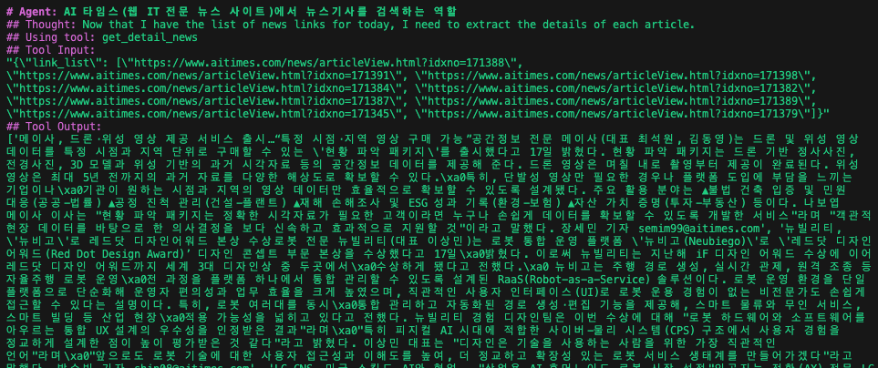
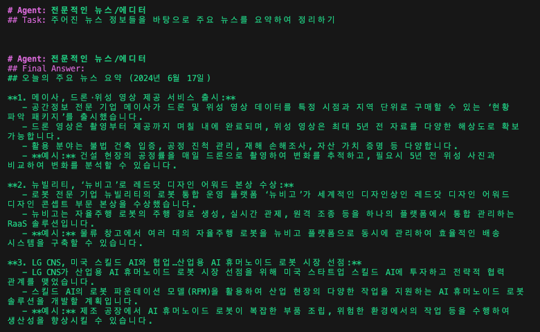

# Agent for summarizing key articles from AI-Time using CrewAI

## Overview

CrewAI를 이용하여 AI타임스의 오늘의 주요뉴스를 요약하고 정리하는 Agent

- vLLM을 이용하여 LLM을 제공함

## Project Structure

```
.
├── config
│   ├── agents.yaml     # agent config file
│   └── tasks.yaml      # task config file
│
├── tools
│   └── custom_tool.py  # news scrape tools
│
├── crew.py             # define tasks, agent and crew
│
└── main.py             # run file
```

## Process

1. `get_today_newslink()` tool을 이용하여 오늘의 주요 뉴스 link 추출



<br>

2. `get_detail_news()` tool을 이용하여 주어진 link의 기사 내용 추출



<br>

3. **Agent**는 주어진 기사를 바탕으로 기사를 요약 및 정리


